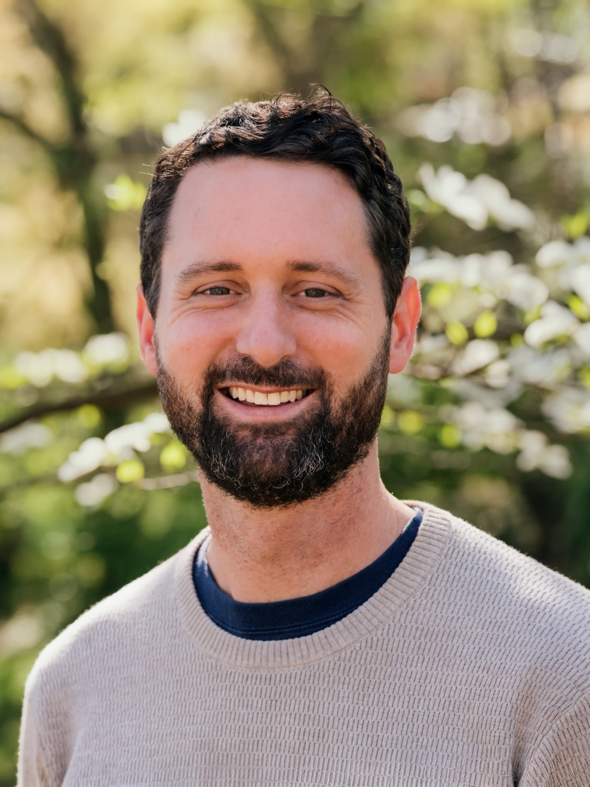

```{=html}
<div class="page-shell page-shell-inner">
  <section class="hero reveal">
    <div class="hero-copy">
      <p class="eyebrow">Biostatistics / Real-World Evidence / Health Research</p>
      <h1>Biostatistics leadership for regulatory-grade real-world evidence</h1>
      <p class="hero-kicker">
        I lead statistical teams, study strategy, and analytic systems for high-quality RWE,
        with experience spanning medical affairs, translational science, and product-facing work.
      </p>
      <p class="hero-text">
        I'm Adam Dugan, a biostatistics leader working at the intersection of science, product,
        and applied analytics. I currently serve as Senior Director, Biostatistics at Datavant,
        where I lead biostatistics and statistical programming within the Science organization and
        help shape how high-quality real-world evidence gets generated. I bring nearly 11 years of
        full-time biostatistics experience, including full-time industry and academic roles held
        during and after my PhD training.
      </p>
      <div class="hero-actions">
        <a class="button button-primary" href="experience.html">View Experience</a>
        <a class="button button-secondary" href="projects.html">Explore Projects, Tools, and Interests</a>
        <a class="button button-secondary" href="contact.html">Contact</a>
      </div>
    </div>

    <aside class="hero-card">
      <div class="headshot-frame">
        
      </div>
      <dl class="profile-facts">
        <div>
          <dt>Current role</dt>
          <dd>Senior Director, Biostatistics</dd>
        </div>
        <div>
          <dt>Organization</dt>
          <dd>Datavant</dd>
        </div>
        <div>
          <dt>Training</dt>
          <dd>PhD, University of Kentucky</dd>
        </div>
        <div>
          <dt>Focus</dt>
          <dd>Regulatory-grade RWE, tooling, and applied AI strategy</dd>
        </div>
      </dl>
    </aside>
  </section>

  <section class="section section-intro reveal" id="about">
    <div class="section-heading">
      <p class="eyebrow">About</p>
      <h2>Grounded in statistical rigor, built for practical impact</h2>
    </div>
    <div class="split-text">
      <p>
        My work connects deep statistical training with real-world execution. My background spans
        academic research, observational methods, healthcare analytics, and product collaboration,
        and today my focus is on building teams, systems, and study practices that make evidence
        generation more reliable, scalable, and useful.
      </p>
      <p>
        I'm especially interested in the operational side of strong science: how teams design
        regulatory-grade real-world evidence studies, create durable analytic workflows, and use
        tools like R, Shiny, and emerging AI capabilities thoughtfully to improve both internal
        efficiency and product direction. The work I find most meaningful sits in the real-world
        evidence space, especially where scientific rigor, cross-functional leadership, and
        practical decision-making need to come together at scale in settings that influence
        biopharma strategy and development.
      </p>
    </div>
  </section>

  <section class="section reveal" id="expertise">
    <div class="section-heading">
      <p class="eyebrow">Expertise</p>
      <h2>Areas of focus</h2>
    </div>
    <div class="card-grid">
      <article class="info-card">
        <h3>Biostatistics Leadership</h3>
        <p>
          Leading biostatistics and statistical programming functions with a focus on quality,
          clarity, and cross-functional impact.
        </p>
      </article>
      <article class="info-card">
        <h3>Regulatory-Grade RWE</h3>
        <p>
          Building best practices for the design and implementation of real-world evidence studies
          intended to meet a high scientific and regulatory bar.
        </p>
      </article>
      <article class="info-card">
        <h3>R Tooling and Analytics Infrastructure</h3>
        <p>
          Developing internal tools, including R packages and Shiny applications, to improve
          analytic robustness, consistency, and efficiency.
        </p>
      </article>
      <article class="info-card">
        <h3>Product and AI Strategy</h3>
        <p>
          Partnering with product teams to identify future product opportunities and apply AI
          thoughtfully in both development workflows and end-user products.
        </p>
      </article>
    </div>
  </section>

  <section class="section reveal">
    <div class="section-heading">
      <p class="eyebrow">Selected Impact</p>
      <h2>Where I tend to add value</h2>
    </div>
    <div class="card-grid">
      <article class="info-card">
        <h3>RWE Study Quality</h3>
        <p>
          Building best practices for study design, SAP development, and implementation that help
          teams produce more credible and review-ready real-world evidence.
        </p>
      </article>
      <article class="info-card">
        <h3>Statistical Team Leadership</h3>
        <p>
          Leading biostatistics and statistical programming functions while mentoring colleagues
          and raising the overall quality and consistency of analysis work.
        </p>
      </article>
      <article class="info-card">
        <h3>R and Workflow Tooling</h3>
        <p>
          Developing internal packages, Shiny applications, and reusable workflows that improve
          efficiency, robustness, and standardization.
        </p>
      </article>
      <article class="info-card">
        <h3>Cross-Functional Strategy</h3>
        <p>
          Partnering across science, product, and technical teams to translate statistical
          judgment into practical decisions and better long-term systems.
        </p>
      </article>
    </div>
  </section>

  <section class="section reveal">
    <div class="section-heading">
      <p class="eyebrow">Navigate</p>
      <h2>A cleaner way to explore the site</h2>
    </div>
    <div class="card-grid">
      <article class="info-card">
        <h3><a href="experience.html">Experience</a></h3>
        <p>Career path across Datavant, Tempus AI, 23andMe, and the University of Kentucky.</p>
      </article>
      <article class="info-card">
        <h3><a href="rwe-focus.html">RWE Focus</a></h3>
        <p>How I think about regulatory-grade study design, scientific quality, and execution.</p>
      </article>
      <article class="info-card">
        <h3><a href="projects.html">Projects, Tools, and Interests</a></h3>
        <p>Shiny tools, methodological examples, and space for future R and AI-related work.</p>
      </article>
      <article class="info-card">
        <h3><a href="publications.html">Publications</a></h3>
        <p>Selected papers and a path back to my broader publication history.</p>
      </article>
      <article class="info-card">
        <h3><a href="contact.html">Contact</a></h3>
        <p>Email, LinkedIn, and a downloadable resume for a quick way to connect.</p>
      </article>
    </div>
  </section>

  <footer class="site-footer">
    <p>(c) <span id="year"></span> Adam J. Dugan, PhD</p>
    <p>Built with Quarto structure in mind for easy GitHub Pages deployment.</p>
  </footer>
</div>
```
